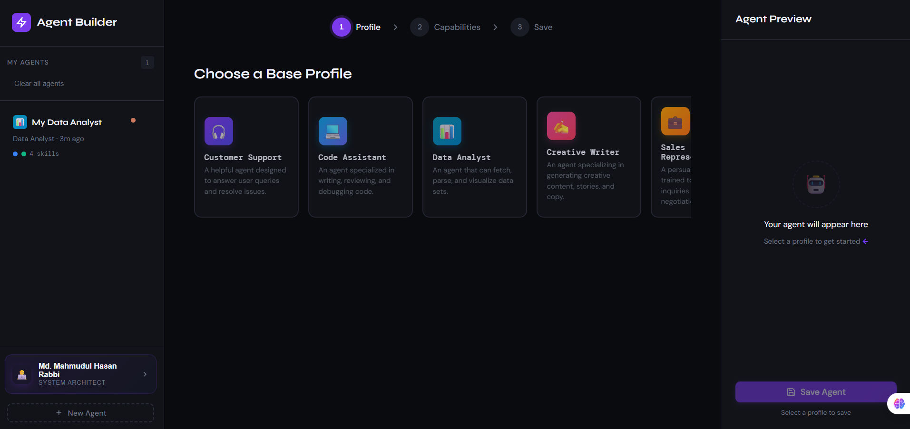
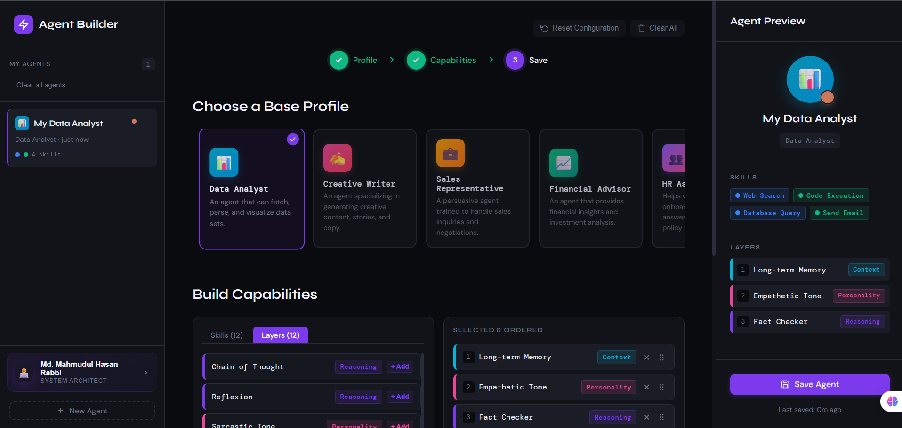
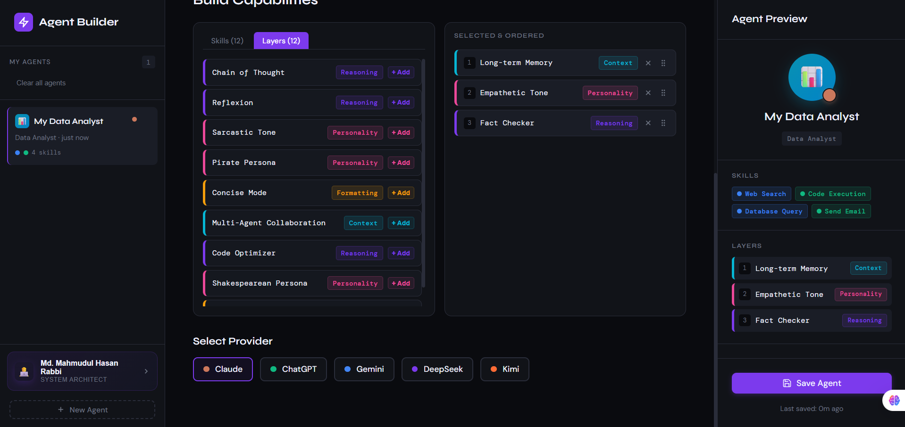
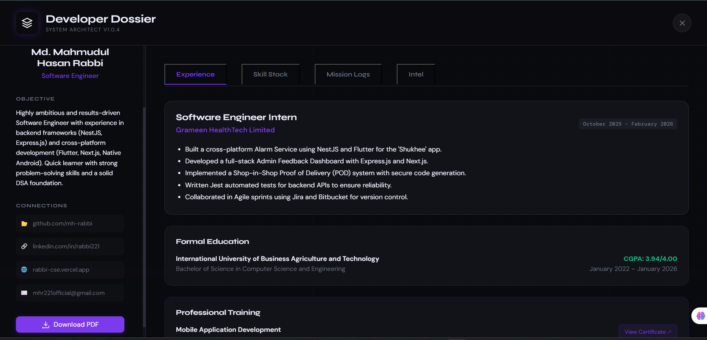

# 🤖 AI Agent Profile Builder

> Constructing the future of AI interfaces with precision and grace.

[](https://react.dev/)
[](https://vitejs.dev/)
[](https://www.typescriptlang.org/)
[](https://tailwindcss.com/)

---

### 🎥 Project Showcase
**Experience the AI Agent Builder in action:**
[Watch the 2-Minute Demo](https://youtu.be/OIkfRezcF7M) 🚀

---

### 🖼️ Visual Gallery

| Landing Interface | Agent Construction |
| :---: | :---: |
|  |  |

| Building Experience | Interactive Dossier |
| :---: | :---: |
|  |  |

---

### ✨ Core Features

- **⚡ High-Performance Architecture**: Leverages React 19 and Vite 8 for near-instant rendering and lightning-fast developer experience.
- **🏗️ Drag-and-Drop Builder**: An intuitive, fluid interface for constructing AI agent profiles, powered by `@dnd-kit`.
- **🕵️ Interactive Developer Dossier**: A futuristic, high-tech presentation of professional skills and experience.
- **🎨 Glassmorphism Design**: A sleek, modern dark-themed UI with subtle micro-animations and smooth transitions.
- **📱 Fully Responsive**: Seamless experience across all devices, from desktop to mobile.

---

### 🚀 Quick Start

1. **Clone the repository:**
   ```bash
   git clone https://github.com/mh-rabbi/ai-agent-builder.git
   cd ai-agent-builder
   ```

2. **Install dependencies:**
   ```bash
   npm install
   ```

3. **Launch the development server:**
   ```bash
   npm run dev
   ```

4. **Build for production:**
   ```bash
   npm run build
   ```

---

### 🛠️ Tech Stack

- **Frontend**: React 19, TypeScript
- **Styling**: Tailwind CSS, Vanilla CSS
- **Interactions**: @dnd-kit (Sortable, Core, Utilities)
- **Build Tool**: Vite 8
- **Quality Control**: ESLint, TypeScript-ESLint

---

### 📜 Mission Accomplished

This project was evolved from a basic scaffold to a production-ready application by:
- ✅ **Resolving React anti-patterns** and performance bottlenecks.
- ✅ **Implementing a modern drag-and-drop UI** for agent construction.
- ✅ **Designing a stunning, responsive interface** that follows best UX practices.
- ✅ **Integrating a developer dossier** that creatively presents technical skills.

---

Built with ❤️ by **Rabbi** in 2026.
